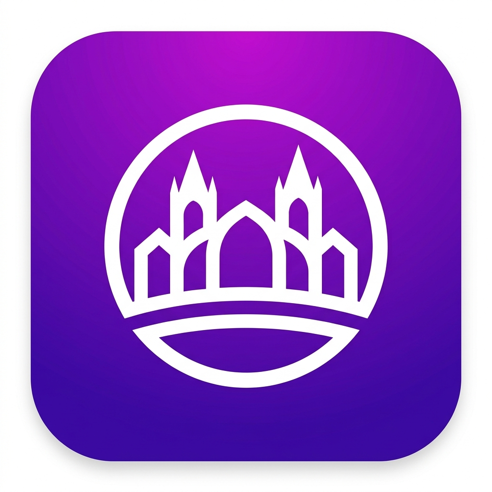
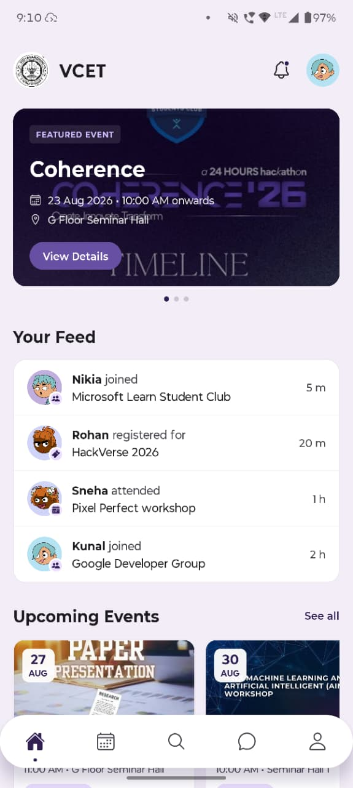
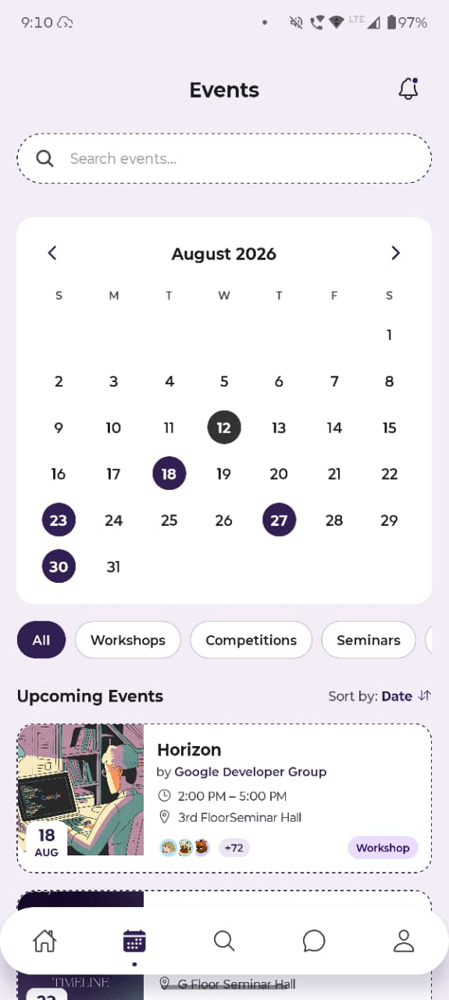
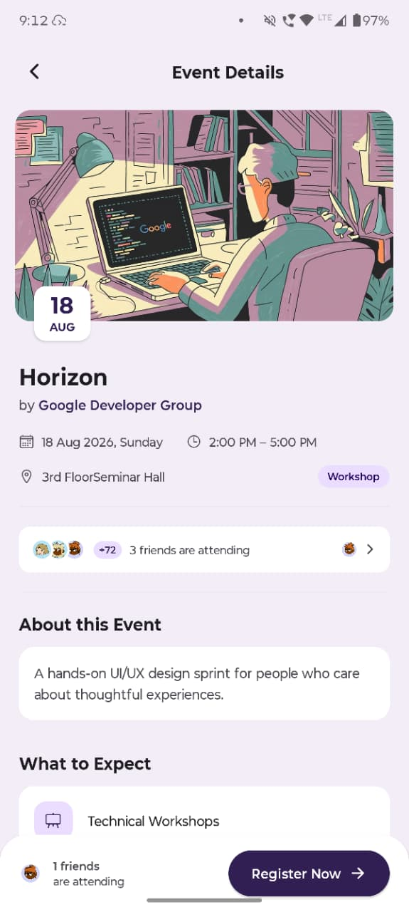
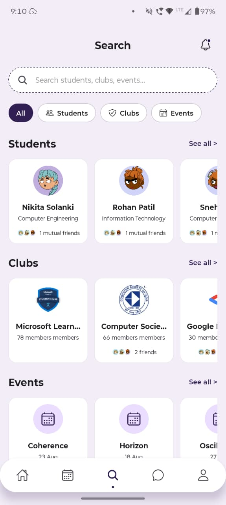
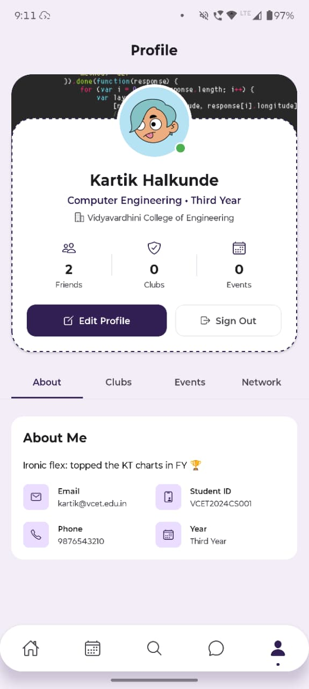
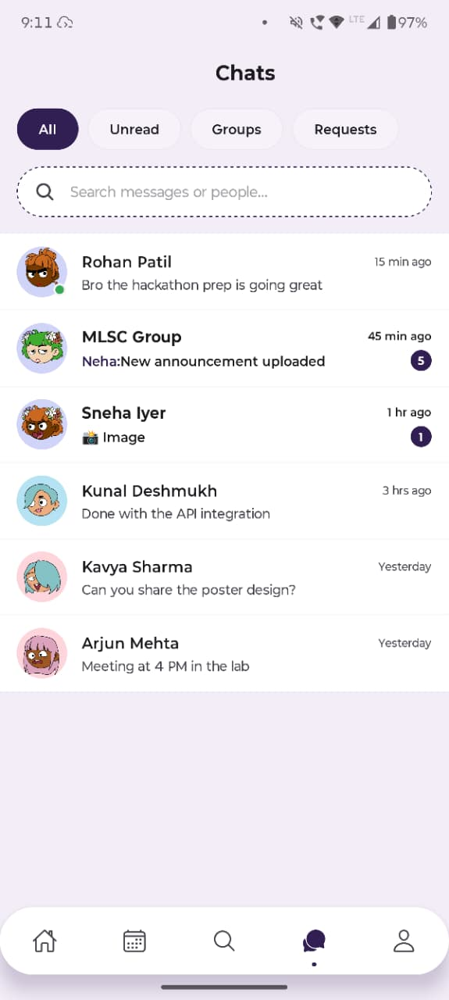

<h1>Campus Circle</h1>

  <h3> Modern College Community & Event Platform </h3>

<h2 style="margin: 0;"><strong>About</strong></h2>
Campus Circle is a cross-platform mobile application that helps you stay connected with your college community. Discover events, join clubs, network with peers, and chat with friends—all in one beautiful, Material Design 3 inspired app.

  

 

 

---

<h1>Screenshots</h1>

---

<h1>Download Now</h1>

<table>
<tr>
<td align="center">

</td>
<td align="center">

</td>
</tr>
</table>

---

# Table of Contents

<table>
<tr>
<td align="left">

- [Features](#features)
- [Building from Source](#building-from-source)
- [Contributing Guide](CONTRIBUTING.md)
- [Report Issues](https://github.com/KartikHalkunde/mlsc-app/issues)

</td>
</tr>
</table>

---

# Features

<table>
<tr>
<td align="left">

- **Interactive Feed:** Stay updated with upcoming campus events and friends' activity.
- **Event Management:** Rich event details, one-click registration, and attendee lists.
- **Networking:** Discover campus clubs, explore roles, and connect with other students.
- **Real-time Chat:** Seamless messaging interface with read receipts, typing indicators, and media support.
- **Personalized Profiles:** Custom avatars, banners, and digital club badges.
- **Material Design 3:** Beautiful, tonal UI with smooth micro-animations.

</td>
</tr>
</table>

  

---

Made with ❤️ by [Kartik Halkunde](https://github.com/KartikHalkunde)

